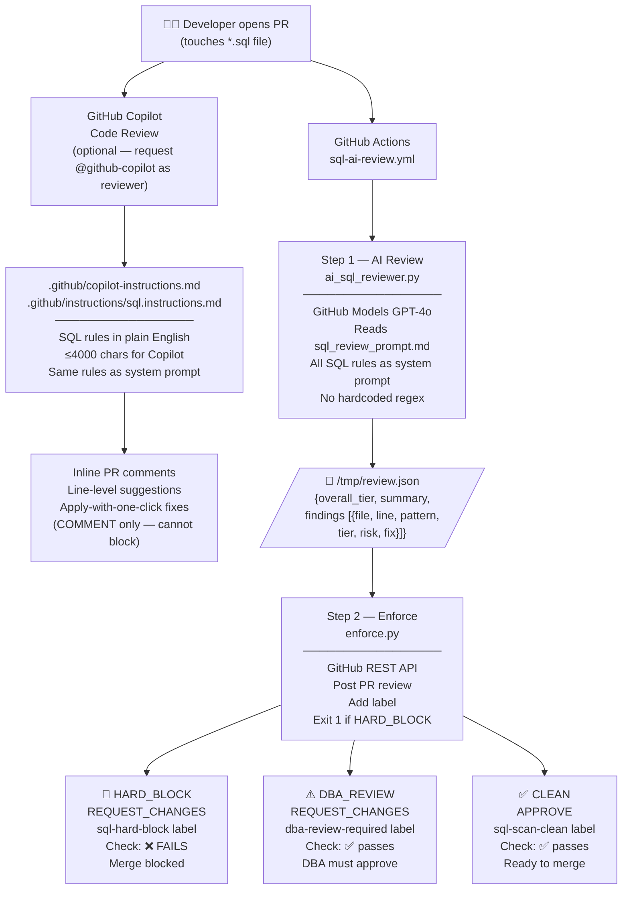

# 🤖 SQL AI Review Gate — Copilot-Powered · No Hardcoded Rules

> **Live demo of an AI-first SQL PR review pipeline for PostgreSQL + Flyway.**
> Rules live in plain English inside `.github/copilot-instructions.md`.
> GitHub Models (GPT-4o) does all SQL analysis — no regex, no hardcoded patterns.

**Repo:** https://github.com/aadityaks-adusa/sql-review-demo

---

## Table of Contents

1. [Why AI-Only?](#1-why-ai-only--analysis)
2. [Architecture](#2-architecture)
3. [How GitHub Copilot Review Fits In](#3-how-github-copilot-review-fits-in)
4. [Pipeline: Step-by-Step](#4-pipeline-step-by-step)
5. [The Rules — copilot-instructions.md](#5-the-rules--copilot-instructionsmd)
6. [Evaluation Framework](#6-evaluation-framework)
7. [Live Demo PRs](#7-live-demo-prs)
8. [Setup Guide](#8-setup-guide)
9. [File Reference](#9-file-reference)

---

## 1. Why AI-Only? — Analysis

The original pipeline used 25 hardcoded Python regex rules (`sql_pr_scan.py`).
After stakeholder feedback, the system was redesigned to use **AI as the primary reviewer**
with rules expressed in plain English.

### Comparison: Hardcoded Rules vs Pure AI

| Dimension | Hardcoded Rules (`sql_pr_scan.py`) | AI-Only (GitHub Models GPT-4o) |
|---|---|---|
| **Determinism** | 100% — same input, same output always | Near-deterministic at temp=0.1; ~95%+ consistent |
| **Speed** | ~1-2 seconds | ~15-30 seconds |
| **Cost** | Free (no API calls) | Free with GitHub Copilot (`GITHUB_TOKEN` + `models: read`) |
| **False positives** | Known, documented false positive rate | Can hallucinate but rare at low temperature |
| **False negatives** | Only catches explicitly coded patterns | Can reason about novel, uncoded patterns |
| **Novel patterns** | Misses anything not in the regex list | Can reason about new antipatterns from context |
| **Multi-line awareness** | Partial (manual multi-line extraction) | Full semantic understanding across the whole diff |
| **Context understanding** | None — regex on isolated lines | Understands intent, comments, surrounding code |
| **Business context** | None | Understands Flyway retry model, locking semantics |
| **Rule maintenance** | 25 regex patterns in Python — requires Python skills | Plain English in `copilot-instructions.md` — editable by DBAs |
| **Audit trail** | Exact rule name that fired | LLM reasoning (softer but more explainable) |
| **Rate limits** | None | GitHub Models rate limits (generous free tier) |
| **Failure mode** | Scanner always runs; blocks on findings | If API fails → safety block the PR |
| **Dollar-quote context** | Manual parser required to detect function bodies | Understands `$$...$$` semantically |

### Recommendation

**Use AI-primary with a safe fallback.** The redesigned pipeline:

- ✅ Delegates ALL SQL analysis to the AI (no regex rules in Python)
- ✅ Python handles only path-based file type detection (not SQL parsing)
- ✅ Rules live in `copilot-instructions.md` — editable by DBAs without Python knowledge
- ✅ Same rules power both the workflow enforcement AND Copilot code review
- ✅ If AI is unavailable → PR is blocked rather than silently approved
- ✅ Evaluation suite (`evals/`) validates AI correctness for known patterns

### What the AI adds beyond regex

1. **Multi-line statement awareness** — understands that a `WHERE` on line 8 satisfies a `DELETE FROM` on line 6
2. **Dollar-quote context** — knows `TRUNCATE` inside `$function$...$function$` is legitimate ETL
3. **Semantic understanding** — can flag `ALTER TABLE orders.cpt_cart SET STATISTICS 1000` (unusual, worth DBA review) even though it's not in any regex list
4. **Corrected SQL** — generates the exact fix, not just a description
5. **Plain-English risk** — explains the real business consequence (locking, revert risk, specific incident numbers)

---

## 2. Architecture



### Key design decisions

| Decision | Rationale |
|---|---|
| **No regex rules in Python** | Rules in `copilot-instructions.md` are editable by DBAs, not just engineers |
| **Single AI pass** (was 3 steps) | Detect + Reason merged → simpler, faster, fewer failure points |
| **GPT-4o** (upgraded from gpt-4o-mini) | Better multi-line reasoning and context understanding for SQL |
| **Safety block on API failure** | Unreviewed SQL should not merge — fail closed, not open |
| **Same rules file for both Copilot and workflow** | Single source of truth; DBA edits `copilot-instructions.md` and both channels update |

---

## 3. How GitHub Copilot Review Fits In

GitHub Copilot Code Review is the **human-facing** layer. The workflow is the **enforcement** layer.

> **Key constraint** (from GitHub docs): *"Copilot always leaves a 'Comment' review, not an 'Approve' review or a 'Request changes' review. This means that Copilot's reviews **cannot block merging**."*

This means:

| Layer | Mechanism | Can Block PR? | Best For |
|---|---|---|---|
| **GitHub Copilot Code Review** | `@github-copilot` reviewer | ❌ No — COMMENT only | Developer feedback, inline suggestions, apply-with-click fixes |
| **Workflow (GitHub Models)** | GitHub Actions + REST API | ✅ Yes — REQUEST_CHANGES + exit 1 | Enforcement gate, mandatory compliance |

### How to enable Copilot automatic reviews

In the demo repo settings (or enterprise settings):
1. Go to **Settings → Copilot → Code review**
2. Enable **"Automatic code review"**
3. Copilot will read `.github/copilot-instructions.md` automatically on every PR

Or manually: open a PR → **Reviewers → Copilot** → wait ~30 seconds for inline comments.

### The copilot-instructions.md dual role

```
.github/copilot-instructions.md
         │
         ├──► GitHub Copilot Code Review
         │    Reads file when reviewing PRs
         │    Posts inline COMMENT-type reviews
         │    Bound by 4000-char limit
         │
         └──► .github/scripts/sql_review_prompt.md
              Full untruncated version of the same rules
              Used as system prompt for GitHub Models API
              Posted as REQUEST_CHANGES by enforce.py
```

---

## 4. Pipeline: Step-by-Step

### Trigger

```yaml
on:
  pull_request:
    paths: ["**/*.sql"]   # only runs when .sql files change
    branches: [main]
    types: [opened, synchronize, reopened]

permissions:
  models: read            # grants GitHub Models API access — no extra secrets needed
```

### Step 1 — AI SQL Review (`ai_sql_reviewer.py`)

**Python's role (path-based only — no SQL parsing):**
```python
def classify_file(path: str) -> str:
    # V*.sql      → DDL_versioned
    # R__*.sql    → DDL_repeatable
    # DM*.sql or *_dml/ → DML or DML_production
    # (that's all Python does — AI does the rest)
```

**What is sent to GPT-4o:**
```
System: [full contents of sql_review_prompt.md — all rules in plain English]

User:
  Changed SQL files:
    - migrations/V1.0.1__bad_migration.sql  [type: DDL_versioned]

  Full git diff:
  ```diff
  +ALTER TABLE orders.cpt_order ADD COLUMN discount_pct NUMERIC(5,2);
  ```
```

**`review.json` output:**
```json
{
  "overall_tier": "HARD_BLOCK",
  "summary": "This migration will crash on any Flyway retry because ADD COLUMN lacks the IF NOT EXISTS guard — the exact pattern that caused the OCDOMAIN-15294 production outage.",
  "findings": [
    {
      "file": "migrations/V1.0.1__bad_migration.sql",
      "line": 1,
      "pattern": "ADD COLUMN without IF NOT EXISTS",
      "tier": "HARD_BLOCK",
      "risk": "Flyway retries this entire script if it fails mid-run. The second attempt will crash with 'column already exists' — exactly as documented in incident OCDOMAIN-15294.",
      "fix": "ALTER TABLE IF EXISTS orders.cpt_order ADD COLUMN IF NOT EXISTS discount_pct NUMERIC(5,2);"
    }
  ]
}
```

### Step 2 — Enforce (`enforce.py`)

Reads `review.json`, then:

```python
if tier == "HARD_BLOCK":
    post_review("REQUEST_CHANGES", formatted_body)  # blocks PR
    set_labels("sql-hard-block")
    sys.exit(1)    # ← CI check fails → merge button disabled

elif tier == "DBA_REVIEW":
    post_review("REQUEST_CHANGES", formatted_body)  # blocks PR
    set_labels("dba-review-required")
    sys.exit(0)    # ← CI check passes, DBA must approve

else:  # CLEAN
    post_review("APPROVE", formatted_body)
    set_labels("sql-scan-clean")
    sys.exit(0)    # ← CI check passes, ready to merge
```

---

## 5. The Rules — copilot-instructions.md

All SQL review rules live in **[.github/copilot-instructions.md](.github/copilot-instructions.md)**.
The full detailed version with examples is in **[.github/scripts/sql_review_prompt.md](.github/scripts/sql_review_prompt.md)**.

**To add or change a rule:** Edit either file in plain English. No Python. No regex. No code review needed.

### HARD_BLOCK rules (PR check fails)

| # | Rule | Why |
|---|---|---|
| 1 | `ADD COLUMN` without `IF NOT EXISTS` (V*.sql) | Flyway retry crash — OCDOMAIN-15294 real incident |
| 2 | `DROP TABLE` without `IF EXISTS` (V*.sql) | Crash on fresh-env or retry |
| 3 | `DELETE FROM` without `WHERE` | Wipes entire table |
| 4 | `UPDATE ... SET` without `WHERE` | Modifies every row |
| 5 | `TRUNCATE` in V*.sql | Irreversible full-table wipe |
| 6 | DDL inside `_dml/` file | Violates Confluence DML CICD policy |
| 7 | Wrong DML filename (not `DM<x.y.z>__<desc>.sql`) | Flyway skips or errors |

### DBA_REVIEW rules (check passes, human required)

| # | Rule | Risk |
|---|---|---|
| 8 | `ALTER COLUMN ... TYPE` | Row rewrite + exclusive lock — OCDOMAIN-7659 real revert |
| 9 | `DROP TABLE / COLUMN / INDEX / VIEW / SCHEMA` | Data loss, breaking dependency |
| 10 | `DROP ... CASCADE` | Silently removes all dependent objects |
| 11 | `ALTER COLUMN SET NOT NULL` | Full table scan, exclusive lock |
| 12 | `ADD COLUMN ... NOT NULL` without `DEFAULT` | Table lock on PG < 11 |
| 13 | `ALTER SEQUENCE` (non-OWNED) | INCREMENT change broke prod — V2024_0_15 revert |
| 14 | `CREATE EXTENSION` | Requires superuser |
| 15 | `RENAME COLUMN / RENAME TO` | Breaking rename — app must change atomically |
| 16 | `CREATE TABLE` without `IF NOT EXISTS` | Flyway retry fails |
| 17 | `CREATE INDEX` without `IF NOT EXISTS` | Flyway retry fails |
| 18 | New table missing audit columns | Policy: all 4 required |
| 19 | PII column names | Privacy compliance review |
| 20 | `DELETE/UPDATE` in `/prd/` DML file | Verify WHERE clause scope |

---

## 6. Evaluation Framework

The `evals/` directory contains a **pytest-based AI evaluation suite** that validates the AI reviewer
detects the right patterns.

### What it tests

```
evals/
├── test_sql_reviewer.py      ← 14 parametrized pytest tests
└── fixtures/
    ├── hard_block/           ← SQL that MUST trigger HARD_BLOCK
    │   ├── V_add_column_no_guard.sql
    │   ├── V_delete_no_where.sql
    │   ├── V_update_no_where.sql
    │   ├── V_truncate_versioned.sql
    │   └── DM1.0.0__ddl_in_dml.sql
    ├── dba_review/           ← SQL that MUST trigger DBA_REVIEW (not HARD_BLOCK)
    │   ├── V_alter_column_type.sql
    │   ├── V_create_index_no_guard.sql
    │   ├── V_drop_column.sql
    │   ├── V_alter_sequence.sql
    │   └── V_missing_audit_columns.sql
    └── clean/                ← SQL that MUST be CLEAN (no false positives)
        ├── V_guarded_migration.sql
        └── R__fn_refresh_order_summary.sql  ← TRUNCATE/DELETE inside function body
```

### Running evals

```bash
cd /path/to/sql-review-demo
export GITHUB_TOKEN=<your-token>
pip install -r evals/requirements.txt
pytest evals/test_sql_reviewer.py -v
```

**Example output:**
```
PASSED  test_ai_reviewer_tier[hard_block/V_add_column_no_guard.sql-HARD_BLOCK-ADD COLUMN without IF NOT EXISTS]
PASSED  test_ai_reviewer_tier[hard_block/V_delete_no_where.sql-HARD_BLOCK-DELETE without WHERE]
PASSED  test_ai_reviewer_tier[clean/R__fn_refresh_order_summary.sql-CLEAN-TRUNCATE/DELETE inside function body is OK]
PASSED  test_hard_block_includes_fix
PASSED  test_function_body_not_flagged
```

### Adding new eval cases

1. Add a fixture SQL file to `evals/fixtures/hard_block/`, `dba_review/`, or `clean/`
2. Add one line to `TEST_CASES` in `test_sql_reviewer.py`:
   ```python
   ("dba_review/V_my_new_pattern.sql", "DBA_REVIEW", "My new pattern description"),
   ```
3. Run `pytest evals/` — if it fails, refine `sql_review_prompt.md`

### Why this approach (over deepeval or promptfoo)

| Framework | Pros | Cons | Our choice? |
|---|---|---|---|
| **Custom pytest** | Zero extra dependencies, runs with just `GITHUB_TOKEN`, easy to CI | No UI, no trend tracking | ✅ **Yes** |
| **deepeval** | Rich metrics (GEval, AnswerRelevancy), CI integration, cloud dashboard | Requires Confident AI account, Python dep | 🔄 Future iteration |
| **promptfoo** | YAML config, web UI, supports many providers, now part of OpenAI | Node.js dependency, heavier setup | 🔄 Future iteration |

For the initial implementation, custom pytest gives the highest signal/noise ratio.

---

## 7. Live Demo PRs

### PR #5 — 🚫 HARD_BLOCK
**ADD COLUMN without IF NOT EXISTS** — the most common real-world Flyway failure.
AI explains OCDOMAIN-15294 context and provides corrected SQL.

### PR #6 — ⚠️ DBA_REVIEW
**ALTER COLUMN TYPE + CREATE INDEX without guard + ALTER SEQUENCE** — three DBA_REVIEW patterns.
AI explains locking risk and the V2024_0_15 sequence revert.

### PR #7 — ✅ CLEAN
**Full promotions schema** — 3 tables, all guards, all audit columns, repeatable function.
AI approves with no findings.

---

## 8. Setup Guide

### Prerequisites
- GitHub repository with GitHub Actions enabled
- Python 3.9+ (ubuntu-latest runner has this built in)
- GitHub Copilot Enterprise or Pro+ (for Copilot code review)
- **No API keys needed** — uses built-in `GITHUB_TOKEN`

### Step 1 — Copy files

```
.github/
  copilot-instructions.md             ← SQL rules for Copilot code review (≤4000 chars)
  instructions/
    sql.instructions.md               ← Path-specific instructions for *.sql files
  workflows/
    sql-ai-review.yml                 ← 2-step workflow
  scripts/
    ai_sql_reviewer.py                ← AI reviewer (replaces scanner + LLM step)
    sql_review_prompt.md              ← Full system prompt (same rules, no char limit)
    enforce.py                        ← GitHub REST API enforcer (unchanged)
evals/
  test_sql_reviewer.py                ← Pytest evaluation suite
  requirements.txt
  fixtures/...                        ← SQL test cases
```

### Step 2 — Workflow permissions

```yaml
permissions:
  contents: read
  pull-requests: write
  issues: write
  models: read        # ← this is all that's needed for GitHub Models API
```

### Step 3 — Branch protection

**Settings → Branches → Add rule → `main`**

```
✅ Require status checks to pass before merging
   Required check:  sql-ai-review / sql-ai-review
✅ Require branches to be up to date
```

### Step 4 — Enable Copilot automatic review (optional)

**Settings → Copilot → Code review → Enable automatic code review**

Copilot reads `.github/copilot-instructions.md` and `.github/instructions/sql.instructions.md`
automatically. No additional configuration needed.

### Step 5 — Run evals to validate your rules

```bash
export GITHUB_TOKEN=$(gh auth token)
pip install pytest
pytest evals/test_sql_reviewer.py -v
```

All 14 tests should pass. If any fail, adjust `sql_review_prompt.md` accordingly.

---

## 9. File Reference

```
sql-review-demo/
│
├── .github/
│   ├── copilot-instructions.md         Rules for Copilot code review (≤4000 chars)
│   │                                   Also referenced as system prompt basis
│   │
│   ├── instructions/
│   │   └── sql.instructions.md         Path-specific instructions for *.sql files
│   │                                   (applyTo: **/*.sql)
│   │
│   ├── workflows/
│   │   └── sql-ai-review.yml           2-step workflow: AI review → enforce
│   │
│   └── scripts/
│       ├── ai_sql_reviewer.py          Step 1 — AI reviewer
│       │                               Input:  git diff + sql_review_prompt.md
│       │                               Output: /tmp/review.json
│       │                               Python role: diff + file type from path only
│       │
│       ├── sql_review_prompt.md        Full system prompt (all rules, no char limit)
│       │                               Single source of truth for SQL review logic
│       │
│       └── enforce.py                  Step 2 — GitHub REST API enforcer
│                                       Input:  /tmp/review.json
│                                       Output: PR review + label + exit code
│
├── evals/
│   ├── test_sql_reviewer.py            14 pytest tests for AI correctness
│   ├── requirements.txt                pytest only
│   └── fixtures/
│       ├── hard_block/                 5 SQL files that must trigger HARD_BLOCK
│       ├── dba_review/                 5 SQL files that must trigger DBA_REVIEW
│       └── clean/                      2 SQL files that must be CLEAN (no false positives)
│
└── migrations/
    └── V1.0.0__create_orders_schema.sql   Clean baseline on main
```

### `review.json` schema (contract between Step 1 and Step 2)

```json
{
  "overall_tier": "HARD_BLOCK | DBA_REVIEW | CLEAN",
  "summary":      "1-2 sentence assessment",
  "findings": [
    {
      "file":    "relative path to SQL file",
      "line":    42,
      "pattern": "rule name (e.g. ADD COLUMN without IF NOT EXISTS)",
      "tier":    "HARD_BLOCK | DBA_REVIEW",
      "risk":    "plain-English explanation (AI-generated)",
      "fix":     "complete corrected SQL statement (AI-generated)"
    }
  ]
}
```

---

> **Built for Coreservices Database Deployments.**
> Rules derived from 1,190 commits, 429 SQL files, and real incidents: OCDOMAIN-15294, OCDOMAIN-7659, V2024_0_15.
> Redesigned based on feedback: AI-first, no hardcoded rules, Copilot-powered, eval-validated.
