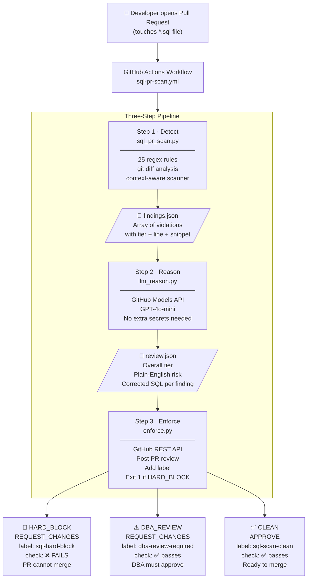

# 🛡️ SQL PR Review Gate — Detect · Reason · Enforce

> **Live demo repo for the Coreservices Database Deployments SQL review automation.**
> Every `.sql` file change in a pull request flows through three automated layers before a single line reaches production.

---

## Table of Contents

1. [What Problem Does This Solve?](#1-what-problem-does-this-solve)
2. [Architecture Overview](#2-architecture-overview)
3. [How CI/CD Triggers](#3-how-cicd-triggers)
4. [Layer 1 — Detect (`sql_pr_scan.py`)](#4-layer-1--detect-sql_pr_scanpy)
5. [Layer 2 — Reason (`llm_reason.py`)](#5-layer-2--reason-llm_reasonpy)
6. [Layer 3 — Enforce (`enforce.py`)](#6-layer-3--enforce-enforcepy)
7. [Live Demo PRs](#7-live-demo-prs)
8. [Risk Tier Reference](#8-risk-tier-reference)
9. [Setup Guide](#9-setup-guide)
10. [File Reference](#10-file-reference)

---

## 1. What Problem Does This Solve?

**Real incident — OCDOMAIN-15294 (PR #573)**

```sql
-- What was merged ❌
ALTER TABLE cart.cpt_cart ADD COLUMN discount_ref_cd VARCHAR(20);

-- Flyway retried on rollback → CRASH:
-- ERROR: column "discount_ref_cd" of relation "cpt_cart" already exists
```

A missing `IF NOT EXISTS` guard caused a production Flyway failure.

**This system catches it automatically** — before the PR can be merged, before it reaches any environment.

### What it replaces / augments

| Without this system | With this system |
|---|---|
| Manual DBA review of every SQL PR | Automated triage → DBA only sees what needs human judgment |
| "Looks fine to me" from a developer | LLM-generated plain-English risk explanation + corrected SQL |
| PR merges with a bad pattern | PR is blocked at the CI gate until the pattern is fixed |
| Inconsistent review quality | 25 rules applied identically to every PR, every time |

---

## 2. Architecture Overview



### Key design decisions

| Decision | Rationale |
|---|---|
| **Static scanner runs first, LLM runs second** | Deterministic rules never hallucinate. The LLM only adds context and corrected SQL on top of already-confirmed findings. |
| **GitHub Models API (GPT-4o-mini)** | Uses the workflow's built-in `GITHUB_TOKEN` — zero extra secrets or API keys needed. |
| **LLM has a fallback** | If the Models API is down, `llm_reason.py` generates structured output from scanner results directly. The pipeline always completes. |
| **Scanner exits 0 — enforce.py owns exit 1** | The scanner never short-circuits the pipeline. The LLM reasons first; the enforcer decides the final exit code. |

---

## 3. How CI/CD Triggers

The workflow is defined in `.github/workflows/sql-pr-scan.yml`:

```yaml
on:
  pull_request:
    paths: ["**/*.sql"]        # only runs when .sql files are changed
    branches: [main]
    types: [opened, synchronize, reopened]

permissions:
  contents: read
  pull-requests: write         # needed to post reviews
  issues: write                # needed to add labels
  models: read                 # needed for GitHub Models API (GPT-4o-mini)
```

**What triggers a re-run:** Any new commit pushed to the PR branch that includes a `.sql` file change.

**Branch protection (recommended):** Set `sql-review / sql-review` as a required status check on `main`. This makes the HARD_BLOCK gate mandatory — the merge button is greyed out until the check passes.

```
Repository Settings → Branches → Branch protection rules → main
  ✅ Require status checks to pass before merging
      Add: "sql-review / sql-review"
  ✅ Require branches to be up to date before merging
```

---

## 4. Layer 1 — Detect (`sql_pr_scan.py`)

### What it does

Runs 25 deterministic regex rules against the lines added in the PR diff. It is context-aware:

- Checks multi-line statements (e.g. `DELETE FROM` on line 5, `WHERE` on line 6 → not flagged)
- Detects PL/pgSQL dollar-quote boundaries — does not flag `TRUNCATE` inside a stored procedure
- Classifies each file as `DDL_versioned`, `DDL_repeatable`, `DML`, or `OTHER`
- Applies different rule sets per file type (e.g. `ADD COLUMN IF NOT EXISTS` check only on `V*.sql`)

### Input

The git diff between `BASE_SHA` and `HEAD_SHA`, resolved via:

```bash
git diff --name-only --diff-filter=ACMR $BASE_SHA $HEAD_SHA
git diff $BASE_SHA $HEAD_SHA --unified=0 -- <file>
```

Environment variables supplied by the workflow:

```
BASE_SHA  = github.event.pull_request.base.sha
HEAD_SHA  = github.event.pull_request.head.sha
SQL_SCAN_FINDINGS_FILE = /tmp/findings.json
```

### Output — `findings.json`

```json
[
  {
    "file": "migrations/V1.0.1__add_discount_feature.sql",
    "file_type": "DDL_versioned",
    "line_number": 14,
    "line_content": "ALTER TABLE orders.cpt_order ADD COLUMN discount_pct NUMERIC(5,2);",
    "pattern": "ADD COLUMN without IF NOT EXISTS",
    "description": "ADD COLUMN without IF NOT EXISTS — Flyway will fail on retry. Real incident OCDOMAIN-15294 (PR #573) was caused by this. Use: ALTER TABLE IF EXISTS <t> ADD COLUMN IF NOT EXISTS <col> ...",
    "tier": "HARD_BLOCK"
  },
  {
    "file": "migrations/V1.0.1__add_discount_feature.sql",
    "file_type": "DDL_versioned",
    "line_number": 18,
    "line_content": "CREATE INDEX idx_cpt_order_discount ON orders.cpt_order(discount_pct);",
    "pattern": "CREATE INDEX without IF NOT EXISTS",
    "description": "Missing IF NOT EXISTS guard — index creation will fail on retry; add IF NOT EXISTS",
    "tier": "DBA_REVIEW"
  }
]
```

### GitHub Actions step summary (written to `$GITHUB_STEP_SUMMARY`)

```
## 🚫 SQL PR Review — BLOCKED

This PR contains SQL patterns that **cannot merge** without senior DBA review and explicit override.

---

### Files Reviewed

| File                                          | Type          | Tier       | Findings |
|-----------------------------------------------|---------------|------------|----------|
| migrations/V1.0.1__add_discount_feature.sql   | DDL_versioned | 🚫 Blocked | 2        |

---

### Findings

| File                                | Line | Pattern                              | Tier          |
|-------------------------------------|------|--------------------------------------|---------------|
| V1.0.1__add_discount_feature.sql    | 14   | ADD COLUMN without IF NOT EXISTS     | 🚫 HARD_BLOCK |
| V1.0.1__add_discount_feature.sql    | 18   | CREATE INDEX without IF NOT EXISTS   | ⚠️ DBA_REVIEW  |
```

---

## 5. Layer 2 — Reason (`llm_reason.py`)

### What it does

Reads `findings.json` and the full git diff, then calls the **GitHub Models API** (`gpt-4o-mini`) with a structured system prompt. The LLM's job is only two things:

1. Explain in 1–2 plain-English sentences **why** each finding is risky
2. Provide the **exact corrected SQL** as a fenced code block

### Input

```
findings.json   (from Step 1)
git diff        (raw diff, capped at 10,000 characters)
GITHUB_TOKEN    (built-in workflow token — grants GitHub Models access)
```

### System prompt (sent to GPT-4o-mini)

```
You are a senior PostgreSQL DBA reviewing Flyway SQL migration files for a large retail enterprise.

Context:
- Migration engine: Flyway — all SQL runs inside a transaction; retries are possible
- File types: V*.sql = versioned DDL (runs once), R__*.sql = repeatable DDL, DM*.sql = DML only
- Environments: nonprd (dev/qa/stage) and prd (production)

An automated scanner has already found specific violations. Your job is ONLY to:
1. Explain WHY each finding is risky in 1-2 plain-English sentences
2. Provide the EXACT corrected SQL as a fenced ```sql code block```

Rules:
- Never suggest CREATE INDEX CONCURRENTLY — Flyway transactions forbid it
- For ADD COLUMN, always use: ALTER TABLE IF EXISTS <schema>.<table> ADD COLUMN IF NOT EXISTS <col> <type>
...

Respond with ONLY valid JSON — no markdown fences, no explanation outside the JSON.
```

### API call (GitHub Models endpoint)

```python
POST https://models.inference.ai.azure.com/chat/completions
Authorization: Bearer <GITHUB_TOKEN>

{
  "model": "gpt-4o-mini",
  "temperature": 0.1,          # near-deterministic for consistency
  "max_tokens": 2500,
  "response_format": {"type": "json_object"},
  "messages": [
    {"role": "system", "content": "<system prompt above>"},
    {"role": "user",   "content": "<findings.json + git diff>"}
  ]
}
```

**No additional secrets or API keys are required.** GitHub Models is gated by `permissions: models: read` in the workflow.

### Output — `review.json`

```json
{
  "overall_tier": "HARD_BLOCK",
  "summary": "This migration has a critical idempotency failure that will crash Flyway on any retry or rollback. The ADD COLUMN statement must include an IF NOT EXISTS guard, as demonstrated by the real production incident OCDOMAIN-15294.",
  "findings": [
    {
      "file": "migrations/V1.0.1__add_discount_feature.sql",
      "line": 14,
      "pattern": "ADD COLUMN without IF NOT EXISTS",
      "risk": "If Flyway retries this migration (e.g. after a partial failure or network blip), it will crash with 'column already exists' — exactly what caused the OCDOMAIN-15294 production outage. This is a hard block because the failure is guaranteed on retry.",
      "fix": "ALTER TABLE IF EXISTS orders.cpt_order ADD COLUMN IF NOT EXISTS discount_pct NUMERIC(5,2);"
    },
    {
      "file": "migrations/V1.0.1__add_discount_feature.sql",
      "line": 18,
      "pattern": "CREATE INDEX without IF NOT EXISTS",
      "risk": "Without the IF NOT EXISTS guard, this index creation will fail on any retry of the migration, leaving the schema in a partially applied state. Note: CONCURRENTLY is not an option inside Flyway transactions.",
      "fix": "CREATE INDEX IF NOT EXISTS idx_cpt_order_discount ON orders.cpt_order(discount_pct);"
    }
  ]
}
```

### Fallback behavior

If the GitHub Models API is unavailable (network error, quota, etc.):

```python
# llm_reason.py automatically falls back to structured scanner output
def _fallback_review(findings, overall_tier):
    return {
        "overall_tier": overall_tier,
        "summary": f"[LLM unavailable — scanner output] {len(findings)} finding(s) detected.",
        "findings": [
            {
                "file": f["file"],
                "line": f["line_number"],
                "pattern": f["pattern"],
                "risk": f["description"],   # scanner description used directly
                "fix": "See Confluence DML CICD policy for the correct form."
            }
            for f in findings
        ]
    }
```

The pipeline continues and the enforcement step still blocks or approves correctly.

---

## 6. Layer 3 — Enforce (`enforce.py`)

### What it does

Reads `review.json` and calls the **GitHub REST API** to:

1. Ensure three labels exist on the repo (`sql-hard-block`, `dba-review-required`, `sql-scan-clean`)
2. Remove any stale scan label from the PR
3. Add the appropriate new label
4. Post a formatted PR review (`REQUEST_CHANGES` or `APPROVE`)
5. Exit with code `1` if `overall_tier == HARD_BLOCK` → fails the required CI check

### Input

```
review.json       (from Step 2)
GITHUB_TOKEN      (built-in — posts reviews as github-actions[bot])
PR_NUMBER         (from github.event.pull_request.number)
REPO              (from github.repository, e.g. "aadityaks-adusa/sql-review-demo")
```

### GitHub API calls made

```
GET    /repos/{REPO}/labels/{name}                    → check if label exists
POST   /repos/{REPO}/labels                           → create label if missing
GET    /repos/{REPO}/issues/{PR}/labels               → get current PR labels
DELETE /repos/{REPO}/issues/{PR}/labels/{name}        → remove stale scan label
POST   /repos/{REPO}/issues/{PR}/labels               → add new label
POST   /repos/{REPO}/pulls/{PR}/reviews               → post the review
```

### PR review body (what the developer sees in the PR)

**For HARD_BLOCK (PR #1 example):**

```
## 🚫 SQL Review — HARD BLOCK — must fix before merge

This migration has a critical idempotency failure that will crash Flyway on any
retry or rollback.

> **How to unblock:** Fix the issue(s) below and push again.
> The scanner will re-run automatically and approve when clean.

---

### Finding 1 of 2 — `ADD COLUMN without IF NOT EXISTS` · 🚫 HARD_BLOCK
**File:** `migrations/V1.0.1__add_discount_feature.sql` · **Line:** 14

> If Flyway retries this migration, it will crash with 'column already exists' —
> exactly what caused the OCDOMAIN-15294 production outage.

**✅ Corrected SQL:**
```sql
ALTER TABLE IF EXISTS orders.cpt_order ADD COLUMN IF NOT EXISTS discount_pct NUMERIC(5,2);
```

---

### Finding 2 of 2 — `CREATE INDEX without IF NOT EXISTS` · ⚠️ DBA_REVIEW
**File:** `migrations/V1.0.1__add_discount_feature.sql` · **Line:** 18

**✅ Corrected SQL:**
```sql
CREATE INDEX IF NOT EXISTS idx_cpt_order_discount ON orders.cpt_order(discount_pct);
```
```

### Exit code logic

```python
if tier == "HARD_BLOCK":
    post_review("REQUEST_CHANGES", body)
    set_labels("sql-hard-block")
    sys.exit(1)          # ← fails the GitHub Actions check → merge button disabled

elif tier == "DBA_REVIEW":
    post_review("REQUEST_CHANGES", body)
    set_labels("dba-review-required")
    sys.exit(0)          # ← check passes but DBA must approve via branch protection

else:  # CLEAN
    post_review("APPROVE", body)
    set_labels("sql-scan-clean")
    sys.exit(0)          # ← check passes, ready to merge
```

---

## 7. Live Demo PRs

> **Repo:** https://github.com/aadityaks-adusa/sql-review-demo

---

### PR #1 — 🚫 HARD_BLOCK · https://github.com/aadityaks-adusa/sql-review-demo/pull/1

**File:** `migrations/V1.0.1__add_discount_feature.sql`

```sql
-- Line 14 ← HARD_BLOCK: missing IF NOT EXISTS
ALTER TABLE orders.cpt_order ADD COLUMN discount_pct NUMERIC(5,2);

-- Line 18 ← DBA_REVIEW: index without guard
CREATE INDEX idx_cpt_order_discount ON orders.cpt_order(discount_pct);
```

**Result:** ❌ check fails · label `sql-hard-block` · `REQUEST_CHANGES` with LLM-generated corrected SQL

---

### PR #2 — ⚠️ DBA_REVIEW · https://github.com/aadityaks-adusa/sql-review-demo/pull/2

**File:** `migrations/V1.0.2__alter_order_status_type.sql`

```sql
-- ALTER COLUMN TYPE — full table rewrite, exclusive lock
ALTER TABLE orders.cpt_order ALTER COLUMN status_cd TYPE VARCHAR(50);

-- CREATE INDEX without IF NOT EXISTS guard
CREATE INDEX idx_cpt_order_customer_status ON orders.cpt_order(customer_id, status_cd);

-- ALTER SEQUENCE INCREMENT — confirmed real production revert (V2024_0_15 → V2024_0_16)
ALTER SEQUENCE orders.cpt_order_order_id_seq INCREMENT BY 5;
```

**Result:** ✅ check passes · label `dba-review-required` · `REQUEST_CHANGES` — DBA must approve

---

### PR #3 — ✅ CLEAN · https://github.com/aadityaks-adusa/sql-review-demo/pull/3

**File:** `migrations/V1.0.3__add_order_notes.sql`

```sql
-- All guards present ✅
ALTER TABLE IF EXISTS orders.cpt_order
    ADD COLUMN IF NOT EXISTS notes_tx VARCHAR(500);

-- All 4 audit columns present ✅
CREATE TABLE IF NOT EXISTS orders.cpt_cancel_reason (
    ...
    audt_cr_dt_tm   TIMESTAMP NOT NULL DEFAULT CURRENT_TIMESTAMP,
    audt_cr_id      VARCHAR(50) NOT NULL DEFAULT CURRENT_USER,
    audt_upd_dt_tm  TIMESTAMP NOT NULL DEFAULT CURRENT_TIMESTAMP,
    audt_upd_id     VARCHAR(50) NOT NULL DEFAULT CURRENT_USER
);

CREATE INDEX IF NOT EXISTS idx_cpt_order_notes ON orders.cpt_order(notes_tx)
    WHERE notes_tx IS NOT NULL;
```

**Result:** ✅ check passes · label `sql-scan-clean` · `APPROVE`

---

### PR #4 — 🚫 HARD_BLOCK (mixed) · https://github.com/aadityaks-adusa/sql-review-demo/pull/4

**Three files across two tiers:**

| File | Change | Tier |
|---|---|---|
| `migrations/V1.0.4__promotions_and_vouchers.sql` | **Renamed** + 150-line DDL schema | ⚠️ DBA_REVIEW (DROP COLUMN, ALTER COLUMN TYPE, CREATE EXTENSION) |
| `migrations/R__fn_get_order_totals.sql` | New repeatable PL/pgSQL function | ✅ CLEAN |
| `cart_dml/DM_deactivate_expired_promos.sql` | New DML — **wrong filename** | 🚫 HARD_BLOCK |

**Why the filename is a HARD_BLOCK:**

```
Flyway uses filenames to determine migration ordering and versioning.
"DM_deactivate_expired_promos.sql" doesn't match the required pattern DM<x.y.z>__<desc>.sql
→ Flyway will silently skip or error at startup.

Required: DM1.0.4__deactivate_expired_promos.sql
```

**Result:** ❌ check fails (DML naming escalates to HARD_BLOCK) · label `sql-hard-block`

---

## 8. Risk Tier Reference

### 🚫 Tier 1 — HARD_BLOCK (PR check fails, merge blocked)

| Pattern | Why blocked |
|---|---|
| `ADD COLUMN` without `IF NOT EXISTS` | Flyway retry crash — OCDOMAIN-15294 (real incident) |
| `DROP TABLE` without `IF EXISTS` | Crash on fresh-env deploy or retry |
| `DELETE FROM` without `WHERE` | Wipes entire table |
| `UPDATE ... SET` without `WHERE` | Modifies every row |
| `TRUNCATE` in a `V*.sql` file | Irreversible full-table wipe |
| DDL inside a `_dml/` file | Violates Confluence DML CICD policy |
| Wrong DML filename | Flyway skips or errors on migration |

### ⚠️ Tier 2 — DBA_REVIEW (check passes, human approval required)

| Pattern | Risk |
|---|---|
| `ALTER COLUMN ... TYPE` | Row rewrite, exclusive lock — OCDOMAIN-7659 real revert |
| `DROP COLUMN / TABLE / INDEX / VIEW / SCHEMA` | Data loss, breaking dependency |
| `DROP ... CASCADE` | Silently removes ALL dependent objects |
| `ALTER COLUMN SET NOT NULL` | Full table scan, exclusive lock |
| `CREATE INDEX` without `IF NOT EXISTS` | Fails on retry |
| `ALTER SEQUENCE` (non-OWNED) | INCREMENT change broke prod — V2024_0_15 revert |
| `CREATE EXTENSION` | Requires superuser |
| `RENAME COLUMN / RENAME TO` | Breaking rename — app must change atomically |
| New `CREATE TABLE` missing audit columns | Policy violation |
| PII column names (`email`, `ssn`, `phone`, etc.) | Privacy review required |

### ✅ Tier 3 — CLEAN

No flagged patterns. All idempotency guards present. Audit columns included where required.

---

## 9. Setup Guide

### Prerequisites

- GitHub repository
- Python 3.9+ (ubuntu-latest runner has this)
- **No additional secrets needed** — uses built-in `GITHUB_TOKEN`

### Step 1 — Copy three scripts

```
.github/scripts/sql_pr_scan.py
.github/scripts/llm_reason.py
.github/scripts/enforce.py
```

### Step 2 — Add the workflow

```
.github/workflows/sql-pr-scan.yml
```

Key points in the workflow:
- `fetch-depth: 0` on checkout — required so `git diff` can see the base commit
- `if: always()` on Step 3 — enforce runs even if the LLM step fails
- `permissions: models: read` — grants GitHub Models API access via `GITHUB_TOKEN`

### Step 3 — Enable branch protection

**Settings → Branches → Add rule → `main`**

```
✅ Require status checks to pass before merging
   Required check:  sql-review / sql-review
✅ Require branches to be up to date before merging
```

### Step 4 — Open a PR with a `.sql` change

The workflow triggers automatically. Within ~30 seconds:
1. Scanner results appear in the **Actions → Summary** tab
2. LLM review appears as a PR review comment from `github-actions[bot]`
3. Label is applied
4. Check passes or fails based on tier

---

## 10. File Reference

```
sql-review-demo/
│
├── .github/
│   ├── workflows/
│   │   └── sql-pr-scan.yml              3-step GitHub Actions workflow
│   │
│   └── scripts/
│       ├── sql_pr_scan.py               Layer 1 — 25 regex rules, context-aware
│       │                                Output: /tmp/findings.json
│       │
│       ├── llm_reason.py                Layer 2 — GitHub Models API (gpt-4o-mini)
│       │                                Input:  /tmp/findings.json + git diff
│       │                                Output: /tmp/review.json
│       │
│       └── enforce.py                   Layer 3 — GitHub REST API enforcer
│                                        Input:  /tmp/review.json
│                                        Output: PR review + label + exit code
│
└── migrations/
    ├── V1.0.0__create_orders_schema.sql      Clean baseline
    ├── V1.0.1__add_discount_feature.sql      PR #1 — HARD_BLOCK demo
    ├── V1.0.2__alter_order_status_type.sql   PR #2 — DBA_REVIEW demo
    ├── V1.0.3__add_order_notes.sql           PR #3 — CLEAN demo
    ├── V1.0.4__promotions_and_vouchers.sql   PR #4 — mixed / big refactor demo
    └── R__fn_get_order_totals.sql            PR #4 — repeatable function demo
```

### Data contracts between layers

**`findings.json`** (Layer 1 → Layer 2):

```json
[
  {
    "file":         "relative path to the SQL file",
    "file_type":    "DDL_versioned | DDL_repeatable | DML | OTHER",
    "line_number":  "integer, 1-based",
    "line_content": "raw SQL line from the diff",
    "pattern":      "rule name e.g. ADD COLUMN without IF NOT EXISTS",
    "description":  "technical explanation of the risk",
    "tier":         "HARD_BLOCK | DBA_REVIEW"
  }
]
```

**`review.json`** (Layer 2 → Layer 3):

```json
{
  "overall_tier": "HARD_BLOCK | DBA_REVIEW | CLEAN",
  "summary":      "1-2 sentence overall assessment",
  "findings": [
    {
      "file":    "relative path",
      "line":    "integer, 1-based",
      "pattern": "rule name",
      "risk":    "plain-English risk explanation (LLM-generated)",
      "fix":     "corrected SQL statement (LLM-generated)"
    }
  ]
}
```

---

> **Built for the Coreservices Database Deployments platform.**
> Scanner rules derived from analysis of 1,190 commits across all branches and 429 SQL files.
> Real incidents referenced: OCDOMAIN-15294 (ADD COLUMN), OCDOMAIN-7659 (ALTER COLUMN TYPE), V2024_0_15 (ALTER SEQUENCE).
